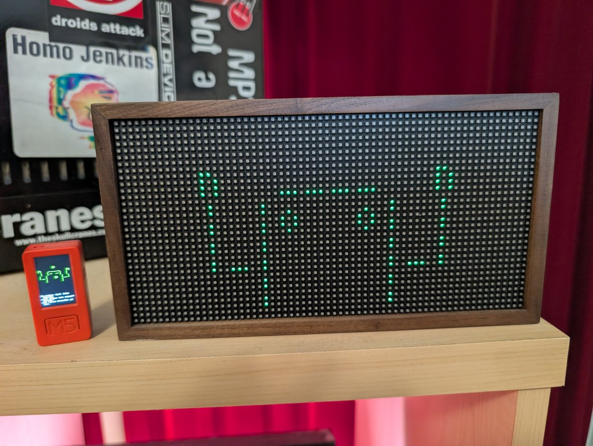
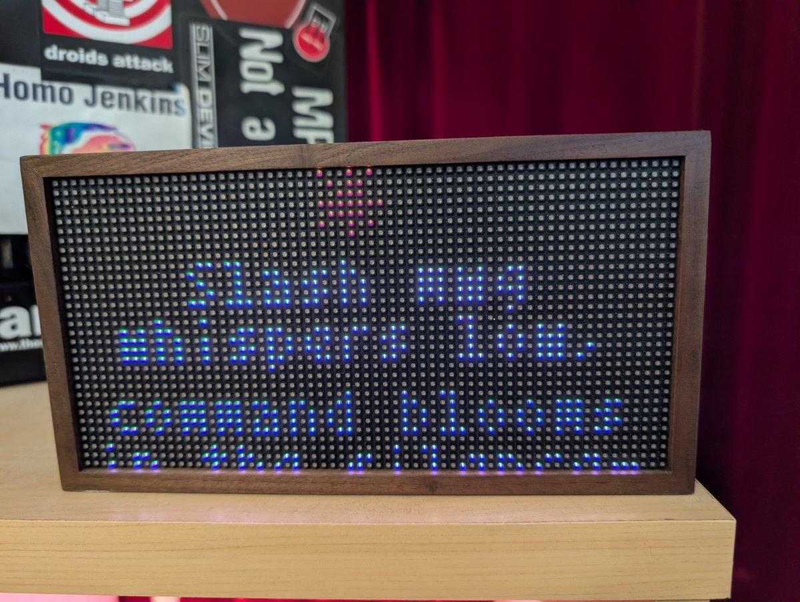

# Familiar

*a desk buddy for Claude Code, on an M5 or a Tidbyt.*

A fork of [`anthropics/claude-desktop-buddy`](https://github.com/anthropics/claude-desktop-buddy)
— Anthropic's opt-in BLE API for Claude, plus an example ESP32 desk pet that
reacts to your sessions. (Their contributing guide says the best contribution
is a fork; this is one.)

Familiar adds three things to it, each optional and layered on the upstream
firmware:

- **A Linux bridge.** Upstream feeds the buddy from the macOS/Windows Claude
  desktop app, which Linux doesn't have. [`linux-bridge/`](linux-bridge/) is a
  small daemon that feeds it from **Claude Code** over BLE instead — no desktop
  app needed.
- **Haiku firmware.** With an API key set, the buddy narrates your session as a
  haiku written by Claude Haiku. The original prompt buddy riffed on your work
  in verse; the desk-pet firmware left that behind, so this puts it back. (Plus
  two single-user tweaks: `busy` at one running session instead of three, and a
  rebalanced portrait charging clock.)
  Every composed haiku is archived locally to
  `~/.local/share/familiar/haikus.jsonl`; `familiar haikus --stats` surfaces the
  trends (recurring imagery, repeated lines, and whether the model is obeying the
  prompt's ban on tired tropes). Outputs only — the model's input is never stored.
  Set `haiku_archive = false` to opt out.
- **A Tidbyt companion.** The same bridge can drive a [Tidbyt](https://tidbyt.com)
  64×32 display — the pet, state-reflective, in any of eighteen ASCII species,
  with the haiku scrolling past when a turn ends. Still rough for hands-off
  distribution (see [Tidbyt companion](#tidbyt-companion)).

Firmware changes stay isolated to `src/main.cpp`, the bridge lives in
`linux-bridge/`, and upstream updates pull from the `upstream` remote. The rest
of this README is upstream's, edited where the fork diverges and with a couple
of sections added — [Credits & license](#credits--license) spells out what's
whose.

---

Claude for macOS and Windows can connect Claude Cowork and Claude Code to
maker devices over BLE, so developers and makers can build hardware that
displays permission prompts, recent messages, and other interactions. We've
been impressed by the creativity of the maker community around Claude -
providing a lightweight, opt-in API is our way of making it easier to build
fun little hardware devices that integrate with Claude.

> **Building your own device?** You don't need any of the code here. See
> **[REFERENCE.md](REFERENCE.md)** for the wire protocol: Nordic UART
> Service UUIDs, JSON schemas, and the folder push transport.

As an example, we built a desk pet on ESP32 that lives off permission
approvals and interaction with Claude. It sleeps when nothing's happening,
wakes when sessions start, gets visibly impatient when an approval prompt is
waiting, and lets you approve or deny right from the device.

<p align="center">
  
</p>

## Hardware

The firmware targets ESP32 with the Arduino framework. As written, it
depends on the M5StickCPlus library for its display, IMU, and button
drivers—so you'll need that board, or a fork that swaps those drivers for
your own pin layout.

## Flashing

Install
[PlatformIO Core](https://docs.platformio.org/en/latest/core/installation/),
then:

```bash
pio run -t upload
```

If you're starting from a previously-flashed device, wipe it first:

```bash
pio run -t erase && pio run -t upload
```

Once running, you can also wipe everything from the device itself: **hold A
→ settings → reset → factory reset → tap twice**.

## Pairing

Two ways to feed the buddy — pick one:

- **macOS / Windows desktop app** (upstream) — the steps below.
- **Linux + Claude Code** (this fork) — pair and run the daemon in
  [`linux-bridge/`](linux-bridge/) instead; skip the rest of this section.

To pair your device with the desktop app, first enable developer mode (**Help →
Troubleshooting → Enable Developer Mode**). Then, open the Hardware Buddy
window in **Developer → Open Hardware Buddy…**, click **Connect**, and pick
your device from the list. macOS will prompt for Bluetooth permission on
first connect; grant it.

<p align="center">
  
  
</p>

Once paired, the bridge auto-reconnects whenever both sides are awake.

If discovery isn't finding the stick:

- Make sure it's awake (any button press)
- Check the stick's settings menu → bluetooth is on

## Controls

|                         | Normal               | Pet         | Info        | Approval    |
| ----------------------- | -------------------- | ----------- | ----------- | ----------- |
| **A** (front)           | next screen          | next screen | next screen | **approve** |
| **B** (right)           | scroll transcript    | next page   | next page   | **deny**    |
| **Hold A**              | menu                 | menu        | menu        | menu        |
| **Power** (left, short) | toggle screen off    |             |             |             |
| **Power** (left, ~6s)   | hard power off       |             |             |             |
| **Shake**               | dizzy                |             |             | —           |
| **Face-down**           | nap (energy refills) |             |             |             |

The screen auto-powers-off after 30s of no interaction (kept on while an
approval prompt is up). Any button press wakes it.

## ASCII pets

Eighteen pets, each with seven animations (sleep, idle, busy, attention,
celebrate, dizzy, heart). Menu → "next pet" cycles them with a counter.
Choice persists to NVS.

## GIF pets

If you want a custom GIF character instead of an ASCII buddy, drag a
character pack folder onto the drop target in the Hardware Buddy window. The
app streams it over BLE and the stick switches to GIF mode live. **Settings
→ delete char** reverts to ASCII mode.

A character pack is a folder with `manifest.json` and 96px-wide GIFs:

```json
{
  "name": "bufo",
  "colors": {
    "body": "#6B8E23",
    "bg": "#000000",
    "text": "#FFFFFF",
    "textDim": "#808080",
    "ink": "#000000"
  },
  "states": {
    "sleep": "sleep.gif",
    "idle": ["idle_0.gif", "idle_1.gif", "idle_2.gif"],
    "busy": "busy.gif",
    "attention": "attention.gif",
    "celebrate": "celebrate.gif",
    "dizzy": "dizzy.gif",
    "heart": "heart.gif"
  }
}
```

State values can be a single filename or an array. Arrays rotate: each
loop-end advances to the next GIF, useful for an idle activity carousel so
the home screen doesn't loop one clip forever.

GIFs are 96px wide; height up to ~140px stays on a 135×240 portrait screen.
Crop tight to the character — transparent margins waste screen and shrink
the sprite. `tools/prep_character.py` handles the resize: feed it source
GIFs at any sizes and it produces a 96px-wide set where the character is the
same scale in every state.

The whole folder must fit under 1.8MB —
`gifsicle --lossy=80 -O3 --colors 64` typically cuts 40–60%.

See `characters/bufo/` for a working example.

If you're iterating on a character and would rather skip the BLE round-trip,
`tools/flash_character.py characters/bufo` stages it into `data/` and runs
`pio run -t uploadfs` directly over USB.

## Environment sensor (this fork)

Mount an [M5Stack ENV-III HAT](https://docs.m5stack.com/en/hat/hat_envIII)
(SHT30 + QMP6988) on the stick's bottom header and it reads the room: a new
**ENV** info page shows ambient temperature, humidity, and barometric pressure,
and the portrait charging clock gains a compact temp + humidity line under the
time. Entirely optional — without the HAT, nothing changes. The sensor sits on
its own I²C bus and is read on a separate core, so it never disturbs the pet,
the IMU, or the animation loop.

## Tidbyt companion

The Linux bridge can also drive a [Tidbyt](https://tidbyt.com) 64×32 LED matrix.
It shows the same pet the stick does — state-reflective, in any of the eighteen
ASCII species (or the bundled `bufo` GIF). The pet needs only the two Tidbyt
keys; if haiku mode is also on (an Anthropic key is set), each finished turn
scrolls its haiku past before returning to the pet.

<p align="center">
  
  
</p>

Pick a species with `tidbyt_pet` in the bridge config; the states map the same
way as the stick (busy / needs-you / celebrate / idle, plus a sleep doze and a
heart for fast turns). Setup — `familiar init`, device keys, choosing a species — is in
[`linux-bridge/`](linux-bridge/#tidbyt-companion).

This is the least-polished part of the fork: it renders locally and pushes over
the Tidbyt cloud API (or a self-hosted
[Tronbyt](https://github.com/tronbyt/tronbyt-server)), so it isn't a one-click
community app yet.

## The seven states

| State       | Trigger                     | Feel                        |
| ----------- | --------------------------- | --------------------------- |
| `sleep`     | bridge not connected        | eyes closed, slow breathing |
| `idle`      | connected, nothing urgent   | blinking, looking around    |
| `busy`      | sessions actively running   | sweating, working           |
| `attention` | approval pending            | alert, **LED blinks**       |
| `celebrate` | level up (every 50K tokens) | confetti, bouncing          |
| `dizzy`     | you shook the stick         | spiral eyes, wobbling       |
| `heart`     | approved in under 5s        | floating hearts             |

## Project layout

```
src/
  main.cpp       — loop, state machine, UI screens
  buddy.cpp      — ASCII species dispatch + render helpers
  buddies/       — one file per species, seven anim functions each
  ble_bridge.cpp — Nordic UART service, line-buffered TX/RX
  character.cpp  — GIF decode + render
  data.h         — wire protocol, JSON parse
  xfer.h         — folder push receiver
  stats.h        — NVS-backed stats, settings, owner, species choice
  env.h          — ENV-III HAT read, own I²C bus + core (this fork)
characters/      — example GIF character packs
tools/           — generators and converters
  extract_buddies.py   — parse a species' poses/timing/color from its .cpp
  render_ascii_pet.py  — render those to Tidbyt WebPs (this fork)
  build_tidbyt_buddy.py— convert bufo GIFs to Tidbyt WebPs (this fork)
linux-bridge/    — `familiar` package: Linux/Claude Code BLE daemon + Tidbyt companion (this fork)
                     run `familiar init` after `uv tool install .` to configure hooks + service
```

## Availability

The BLE API is only available when the desktop apps are in developer mode
(**Help → Troubleshooting → Enable Developer Mode**). It's intended for
makers and developers and isn't an officially supported product feature.

## Credits & license

Upstream: [`anthropics/claude-desktop-buddy`](https://github.com/anthropics/claude-desktop-buddy),
MIT-licensed, © Anthropic, PBC — see [LICENSE](LICENSE), which this fork keeps
intact. The Linux bridge, haiku firmware, and Tidbyt companion are additions by
this fork's maintainer; everything else is upstream's, including the wire
protocol in [REFERENCE.md](REFERENCE.md) and the ASCII pets.
